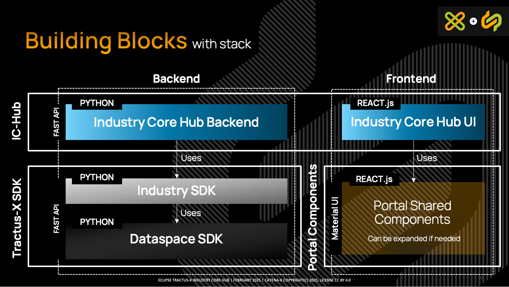
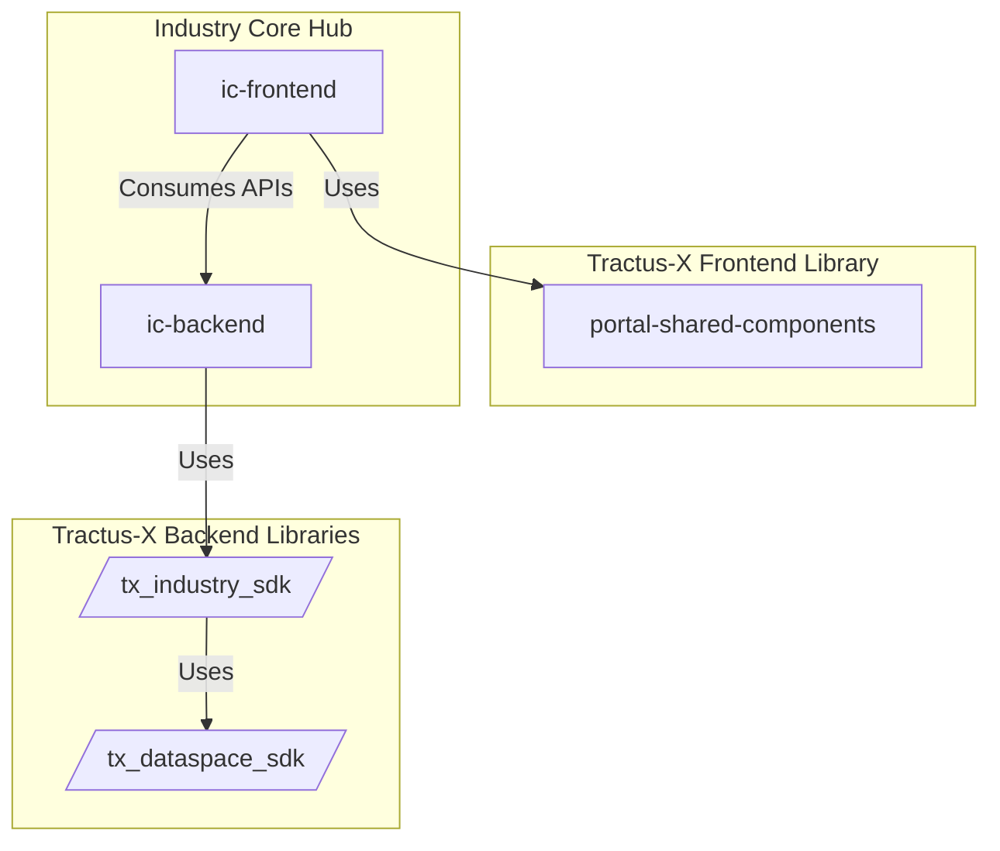
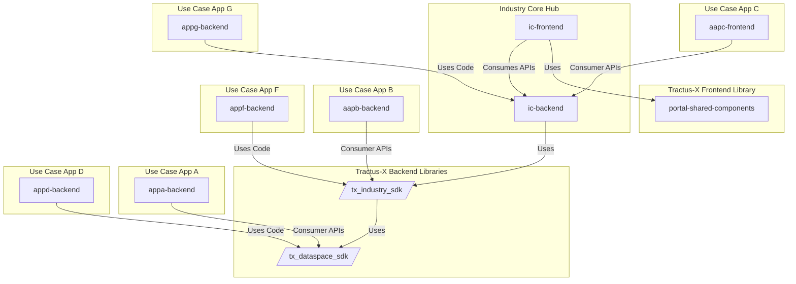
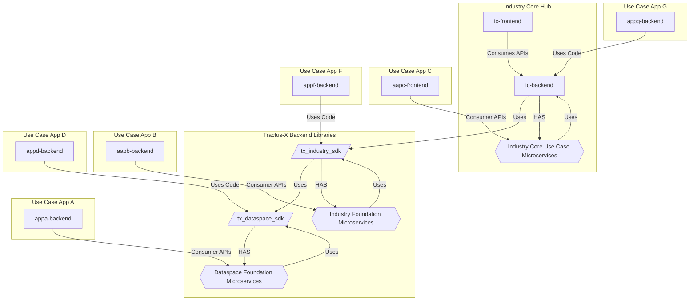
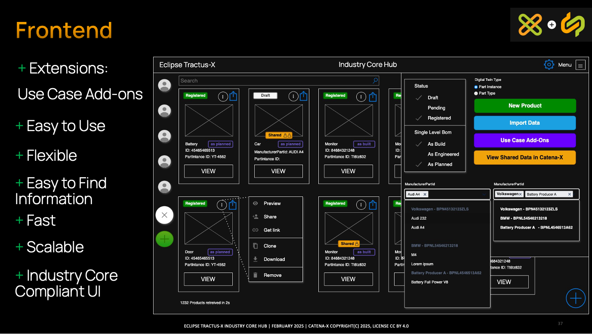

# Industry Core Hub

<p align="center">
  
</p>


A decentral lightweight, **plug and play data provision & consumption orchestrator** of the:

- [Tractus-X Eclipse Dataspace Connector (EDC)](https://github.com/eclipse-tractusx/tractusx-edc)
- [Tractus-X Digital Twin Registry](https://github.com/eclipse-tractusx/sldt-digital-twin-registry)
- [Simple Data Backend](https://github.com/eclipse-tractusx/tractus-x-umbrella/tree/main/simple-data-backend)

It gives you the **DATASPACE KICKSTART** you need to adopt the Tractus-X Technology Stack, once you are onboarded to the operative data space.

**Additional Services**:

- Discovery Services:
  - [Discovery Finder](https://github.com/eclipse-tractusx/sldt-discovery-finder)  
  - [BPN Discovery](https://github.com/eclipse-tractusx/sldt-bpn-discovery)
  - [EDC Discovery](https://github.com/eclipse-tractusx/portal-backend)
  
- [Portal IAM/IDP](https://github.com/eclipse-tractusx/portal-iam)

## Overview

The Industry Core Hub is an plug-and-play application that allows use cases to build their logic without needing to understand in detail how the basic dataspace components (EDC, AAS/Digital Twin Registry, Submodel Server/Any Data Source) work.

This application is built taking into consideration the best practices and standards of Catena-X Industry Core and Dataspace experts. It aims to create a real speedway for use cases. Allowing applications to be developed in less than two weeks.

An application that allows you to provide and consumer data from your partners using the Catena-X Dataspace. This open source solution can be integrated into your business applications, open source applications and many other components. 

Building on a strong, scalable and fundamented foundation by Experts, and with the aim of reducing the complexity of a dataspace for the external constumer, like SMEs that want to be compatible with Catena-X, Factory-X, and many other dataspaces.

## Roadmap
```
February 3 2025     R25.06             R25.09          R25.12
Kickoff              MVP                Stable          NEXT            2026 -> Beyond
| ------------------> | ----------------> | -----------> |  ----------------> | 
                Data Provision     Data Consumption    IC-HUB             + KIT Use Cases
                 Orchestrator        Orchestrator        + Integrate First
                                                           Use Case (e.g. DPP)
```

## Objectives

- reduce the complexity of the Eclipse Tractus-X Adoption.
- create an stable, scalable and easy to use backend SDK for the use case applications.
- enable the 1.000 users goal of Catena-X for 2025.
- give a simple and re-usable application for Small and Medium Companies that want to adopt the dataspace with data provision and consumption.
- allow new applications to be build over a stable foundation of a dataspace.
- create a technical foundation for technical enablement services to be used in a easy way.
- create a industry core stack

## Building Blocks (with stack)



## Component Organization



Designed for scalability and fast adoption

## Possible Adoption Ways

Here is an example of how this application can be adopted from various use cases



## Tractus-X Microservices for Dataspace, Industry & Industry Core Use Case



## Frontend



## High Level Architecture


## The Catena-X Speedway


## How to Get Involved

- **Get onboarded**: [Getting started](https://eclipse-tractusx.github.io/docs/oss/getting-started/). Join the Eclipse Tractus-X open source community as a contributor!
- Attend the [official community office hours](https://eclipse-tractusx.github.io/community/open-meetings/#Community%20Office%20Hour) and raise your issue!


### Found a bug?

👀 If you have identified a bug or want to fix an existing documentation, feel free to create a new issue at our project's corresponding [GitHub Issues page](https://github.com/eclipse-tractusx/industry-core-hub/issues/new/choose)

 ⁉️ Before doing so, please consider searching for potentially suitable [existing issues](https://github.com/eclipse-tractusx/industry-core-hub/issues).

🙋 **Assign to yourself** - Show others that you are working on this issue by assigning it to yourself.
<br> To do so, click the cog wheel next to the Assignees section just to the right of this issue.

### Discuss

📣 If you want to share an idea to further enhance the project, please feel free to contribute to the [discussions](https://github.com/eclipse-tractusx/industry-core-hub/discussions),
otherwise [create a new discussion](https://github.com/eclipse-tractusx/industry-core-hub/discussions/new/choose)

## Reporting a Security Issue

Please follow the [Security Issue Reporting Guidelines](https://eclipse-tractusx.github.io/docs/release/trg-7/trg-7-01#security-file) if you come across any security vulnerabilities or concerns.
