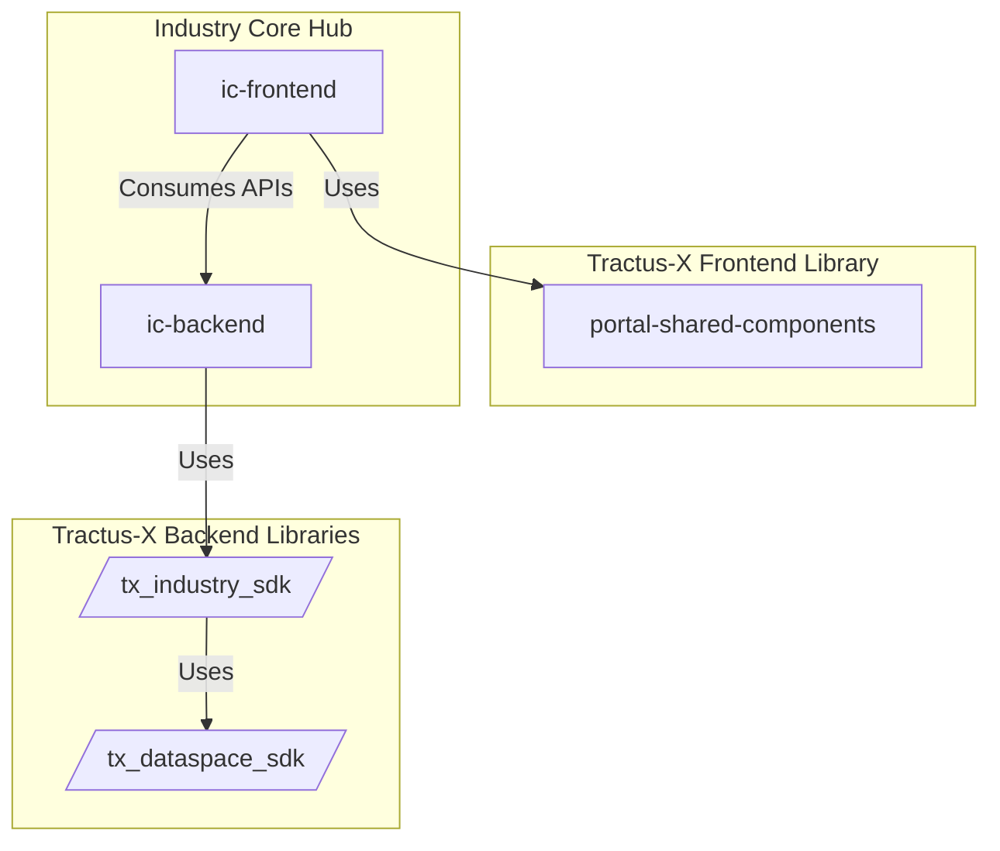
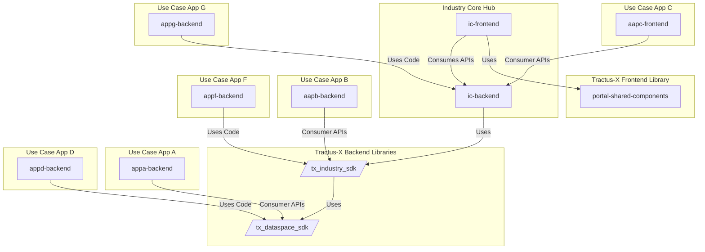
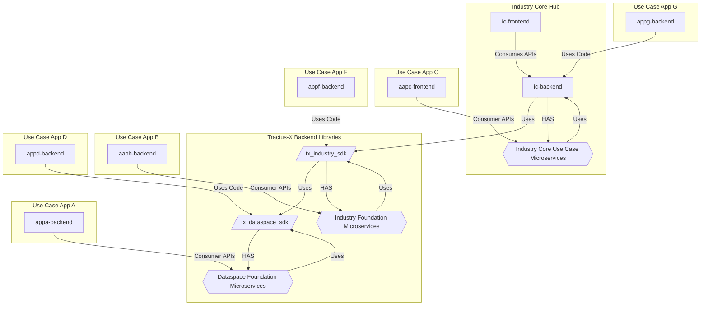

# 2. Tractus-X SDK

Decision Date: 2025-01-15

Documented: 2025-01-27

## Status

Accepted

## Context

From any Use Case application perspective the following abstraction layers are required to build the use case business logic:


Currently, the Eclipse Tractus-X Use Case applications need to integrate their Dataspace Foundation (EDC Logics) and Industry Foundation (AAS Logic) logical structure individually.
It was observed that the Tractus-X Use Case applications that build over the Industry Core have a performance inconsistency, varying from application to application.
Some are able to retrieve data using the Dataspace Foundation effectively, and other are able to retrieve using the Industry Foundation effectively do not manage correctly the Dataspace Foundation. Leading to a lack of speed, because the applications are building and maintaining their own data structures, APIs, architecture and external application management logic (EDC, DTR, Submodel Service)

Here is a list of applications that use the Industry Core:

- Digital Product Pass
- Item Relationship Service (IRS)
- Trace-X (Based on the IRS)
- PURIS
- Simple Data Exchanger

Another issue is that a new use case wants to build over the Industry Core KIT, the developers are "obligated" to understand the deep technical concepts of the Eclipse Dataspace Connector and the Digital Twin Registry. This degrades the Learning Curve and difficult the adoption of the Dataspace by the creation of new Use Cases.

Last but not least, these applications do not implement in a harmonized way the "data provision" logic, difficulties the compatibility and maintainace of "basic" dataspace functionalities in between use case applications.

An observed example of this is when an EDC upgrade takes place, and braking changes are detected, the application are required to change their complete logic in some cases. Which can lead to their deprecation when no available capacity for updating is available. And even if some capacity is available from the Tractus-X Community Perspective, a deep technical knowledge of each use case application is required to perfom the changes effectively, which difficult even more the robustness, scalability and adoption of the Dataspace.

The development of a Reference Implementation from the Industry Core KIT was necessary to harmonize the Application Programming Interfaces (APIs), data registration schemas in the Digital Twin Registry and Eclipse Dataspace Connector, data exchange algorithms, dataspace usage patterns and data sovereignty (permissions) configuration for specific submodels and aspect models.

For developing an Industry Core Reference implementation as defined by the requirements a "CRUD" from the Eclipse Dataspace Connector, the Digital Twin Registry and the Submodel Server are required. Which has a high level of complexity and if not configured correctly could cause serious performance and security issues.

### Key Challenges

1. **Complexity for New Use Cases**  
   Developers building new use cases must understand the deep technical concepts of the Eclipse Dataspace Connector (EDC) and Digital Twin Registry (DTR). This increases the learning curve and discourages the adoption of the Dataspace for new use case development.

2. **Lack of Harmonization in Data Provision Logic**  
   The data provision logic is not harmonized across applications, leading to compatibility and maintenance issues for basic Dataspace functionalities between use case applications.

3. **Impact of EDC Upgrades**  
   When the EDC undergoes an upgrade with breaking changes, applications often require significant updates to their logic. This is particularly challenging when:
   - No development capacity is available to update deprecated logic.
   - Deep technical knowledge of each use case is required to perform updates effectively.

4. **High Complexity of Reference Implementation Development**  
   Developing a reference implementation for the Industry Core KIT requires:
   - CRUD operations for the Eclipse Dataspace Connector.
   - Integration with the Digital Twin Registry and Submodel Server.
   This complexity can lead to performance and security issues if not configured properly.

## Decision

Therefore, because the Industry Core Hub need to implement the same functionalities and algorithms from the other use case reference implementations, and it wants to enable that use case applications can be able to build over the industry core (re-use components or apis), it was **decided** that to reduce the complexity, improve the performance and maintenance of the future adopters of the industry and the dataspace foundation an **Eclipse Tractus-X SDK** would be implemented using the "best practices" of business "non-open-source" industry core reference implementations (which are available in productive systems) and Tractus-X Reference Implementations that have utilized the Industry Core KIT to implement their business logic.

The Eclipse Tractus-X SDK implements a "plug-and-play" logic using following "framework libraries" that implement abstracted code interfaces for building use case applications with a minimal complexity and with minimal effort:


In the end the Industry Core Hub would act as an "example" on how to correctly use the SDK and embedding into your source code.

### Programming Language

It was **decided** that the programming language is going to be **Python**.

The rationale behind this decision is:

- **Industry Adoption**: The programming language utilized by the Commercial Industry Core "non-open-source" reference implementations is Python.
- **Popularity and Accessibility**: Python is currently the most popular programming language in the world, so for easing the future maintenance and understanding of the code by several developers with different stacks, they are able to align on the "algorithms" by using a "common" language.
- **Readability**: Python is more easy to read and understand by "non-technical" stakeholders, which are experts in the industry core and need to review the algorithms.
- **Versatility**: Python is a lightweight, significant fast (but not as Java) and easy to scale language, the SDK components can be easily used in the Cloud, in Local, in a Jupiter Notebook and in a variety of different scenarios. Because no actually compilation is needed, since Python is an interpreted language.
  - A clear "cut" between the Eclipse Dataspace Connector, Digital Twin Registry and Use Case applications wanted to be set, being agnostic of the programming language of the EDC.
  - The algorithms can easily be translated from one language to another.
- **Data Handling**: The JSON and data handling is optimal in Python, allowing more flexibility on data formats and structures when handling metadata.
- **Community Growth**: The objective is to make Tractus-X popular (road to 1.000) and more people to actively contribute to the open source community and boost the "long term maintainable"
- **Python Support in Tractus-X**: There is not yet a "stable" python code reference implementation in Tractus-X, currently it is only limited to JAVA, which difficult the development of applications in other programming languages, so this SDK will provide an easy way of developing apps in Tractus-X.
- **Complexity Reduction**: This SDK wants to enable the versatility of the Tractus-X Adoption, focusing on the Development Speed and complexity reduction. Since the current preferred programming language (Java) is a complex language, it hinders the algorithm understanding, simple use case logics and AI integration.
- **Bridge with Java Ecosystem**: The SDK will remain agnostic of EDC’s underlying programming language, enabling compatibility across different technologies.

## Benefits

- **Faster Development**:  
  New Eclipse Tractus-X KIT reference implementations that use the Industry Core KIT as a base are able to "kickstart" their development without needing to deeply understand the Dataspace and Industry Foundations.  
  - Applications can be developed with minimal effort and very fast (e.g., within 2 weeks).  
  - Developers can focus more on implementing business-specific logic instead of spending time on complex integrations.  

- **Ease of Understanding**:  
  The SDK simplifies Tractus-X core dataspace logic, making it accessible to both technical and non-technical stakeholders.  
  - Non-technical stakeholders, such as industry experts, can review and validate logic more effectively due to Python’s readability.  
  - Developers no longer need to learn the intricacies of EDC, DTR, and Submodel Service to build new use cases.

- **Cross-Language Proofing**:  
  The SDK serves as an "agnostic" test suite for validating microservice functionalities of the Eclipse Dataspace Connector (EDC) and Digital Twin Registry (DTR).  
  - This allows developers to verify that the core functionalities work as expected without requiring Java integration.  
  - It creates a foundation for introducing other programming languages into the ecosystem in the future.  

- **Flexibility**:  
  The SDK ensures flexibility for incorporating additional components and reference implementations in the future.  
  - For example, BASYX or other Digital Twin Registry implementations can be integrated seamlessly without disrupting existing use case application logic.  
  - Developers can choose technologies and components that best suit their specific requirements while staying compatible with the Tractus-X ecosystem.  

- **Standardized Development Practices**:  
  The SDK enforces a consistent approach to building use case applications by harmonizing APIs, data schemas, and data provision logic.  
  - This ensures compatibility across all applications within the Tractus-X ecosystem.  
  - Developers can follow clear guidelines and best practices embedded in the SDK, leading to better overall application quality.  

- **Improved Scalability**:  
  With a unified and optimized architecture provided by the SDK, applications can scale more effectively to handle increased data exchange and processing loads.  
  - The SDK's abstractions reduce performance bottlenecks caused by inconsistent logic implementation across use cases.  

- **Reduced Learning Curve for Developers**:  
  By abstracting the complexity of EDC and DTR, the SDK lowers the barrier to entry for new developers.  
  - Onboarding becomes quicker, enabling teams to focus on delivering business value rather than understanding low-level integrations.  
  - This is especially useful for teams with diverse technical backgrounds.  

- **Enhanced Interoperability**:  
  The SDK improves interoperability between applications by standardizing how they interact with Dataspace Foundation and Industry Foundation components.  
  - This reduces the risk of compatibility issues and ensures smooth communication between different systems.  
  - Enables the smooth future integration of new systems (e.g. Eclipse Basyx)

- **Faster Updates and Maintenance**:  
  By centralizing core logic within the SDK, updates (e.g., for EDC or DTR upgrades) can be implemented once and applied across all dependent applications.  
  - This significantly reduces the maintenance burden on individual use case applications.  

- **Support for Innovation**:  
  The SDK allows developers to focus on innovation and business logic by simplifying the foundational integration tasks.  
  - This enables rapid prototyping and experimentation, fostering creativity in building new features and applications.  

- **Built-In Best Practices**:  
  The SDK incorporates industry best practices derived from non-open-source and Tractus-X reference implementations.  
  - Developers benefit from pre-built, production-ready components, improving the reliability and performance of their applications.  

- **AI and ML Integration**:  
  Python's compatibility with popular AI/ML libraries (e.g., TensorFlow, PyTorch) makes it easier to integrate advanced data processing, prediction, and analytics capabilities into Tractus-X use cases.  

- **Broader Community Engagement**:  
  The use of Python, a widely popular language, attracts a diverse developer base, including contributors from startups, academia, and research institutions.  
  - This increases contributions to the open-source Tractus-X community and fosters faster innovation.  

- **Multi-Environment Usability**:  
  The SDK can be used in various environments, including local systems, cloud platforms, and Jupyter Notebooks, providing developers with unmatched versatility.  

- **Proven Versatility**:  
  Applications developed using the SDK are future-proofed against technological shifts, as the SDK’s design remains agnostic to the underlying language or architecture of the Dataspace.

## Consequences

- **Performance Dependency**:  
  Since applications built using the SDK rely on its core functionality, any performance issues in the SDK will directly affect all dependent use case applications. This dependency makes the SDK's optimization and testing critical to ensure smooth operations.  

- **Maintenance Overhead**:  
  Centralizing core logic in the SDK requires consistent updates and maintenance to align with changes in EDC, DTR, and Submodel Service. If not actively maintained, the SDK could become a bottleneck for the ecosystem.
  - **Mitigation**: Include different stakeholders and **long term** users of Tractus-X in the development to create a stable and maintainable source code.

- **Non-Reuse of Java Models**:  
  The SDK does not directly reuse the Java-based Tractus-X models, creating a gap between existing implementations and new Python-based ones.  
  - **Mitigation**: Tools like JPype can bridge this gap by enabling the reuse of Java components within the Python ecosystem.

- **Technical Debt from Diverging Ecosystems**:  
  Managing two distinct programming ecosystems (Python and Java) over time may lead to technical debt, especially if the Tractus-X community focuses more heavily on one language. Diverging implementations could result in reduced compatibility.  
  - **Mitigation**: Establish robust interoperability mechanisms, such as REST APIs or gRPC, to ensure seamless interaction between Python and Java components.

- **Risk of Reduced Performance Flexibility**:  
  Abstracting core logic into the SDK may introduce performance trade-offs in specific edge cases, as developers might have less control over low-level optimizations.
  - **Mitigation**: Web-sockets could be supported in the future, allowing real time communication to occur and enable fast processing.

## Mitigation of Programming Language

- For mitigation of the "non-java" reusability of EDC components can be applied. By using jpype we are able to load the Eclipse Dataspace Connector java modules:

```python

from fastapi import FastAPI
import jpype

app = FastAPI()

# Start the JVM at the server startup
@app.on_event("startup")
def start_jvm():
    jpype.startJVM(classpath=["libs/*"])

# Shut down the JVM when the server stops
@app.on_event("shutdown")
def stop_jvm():
    jpype.shutdownJVM()


@app.post("/process")
def process_data(input_data: dict):
    from org.eclipse.dataspaceconnector.spi import DataSpaceConnector
    connector = DataSpaceConnector()
    result = connector.someMethod(input_data["param"])
    return {"result": result}

```

The server should be deployed in the startup and will easy the import of the models from the EDC.

### Microservices for every Foundation Abstraction

It will be set for every Dataspace and Industry Foundation a Microservice interface that will allow non-python applications to use it using REST APIs.

More details below in the [Component Organization Details](#possible-adoption-ways)

## Component Organization



Designed for scalability and fast adoption

## Possible Adoption Ways

Here is an example of how this application can be adopted from various use cases



## Tractus-X Microservices for Dataspace, Industry & Industry Core Use Case



## NOTICE

This work is licensed under the [CC-BY-4.0](https://creativecommons.org/licenses/by/4.0/legalcode).

- SPDX-License-Identifier: CC-BY-4.0
- SPDX-FileCopyrightText: 2025 Contributors to the Eclipse Foundation
- Source URL: https://github.com/eclipse-tractusx/industry-core-hub