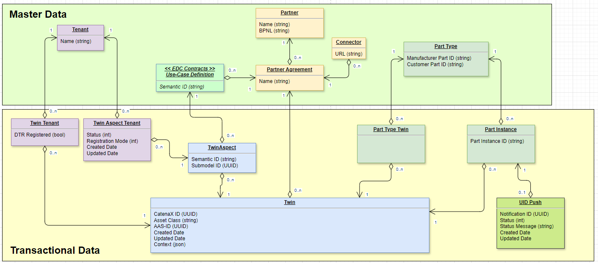

<!--

Eclipse Tractus-X - Software Development KIT

Copyright (c) 2025 Contributors to the Eclipse Foundation

See the NOTICE file(s) distributed with this work for additional
information regarding copyright ownership.

This work is made available under the terms of the
Creative Commons Attribution 4.0 International (CC-BY-4.0) license,
which is available at
https://creativecommons.org/licenses/by/4.0/legalcode.

SPDX-License-Identifier: CC-BY-4.0

-->

# 4. Data Storage Persistence Architecture

Date: 2025-02-20

## Status

Accepted

## Context

The persistence storage will be done in SQL probably using PostgreSQL.

It is required to agree in a data model, therefore it was proposed by @sm29105 to take his example as a start: 

## Decision

Use a SQL database for the industry core hub backend, so we can perform queries very fast and do complicated queries.

Is important to note that the data model still need to be aligned. It was decided it will store just "Metadata" from the products and the relationships knowing where everything is registered and with each permission.

It will be called "Metadata Registry" an will support the backend to use the different systems with the Tractus-X SDK which will not have persitance. Decided here: https://github.com/eclipse-tractusx/tractusx-sdk/blob/main/docs/architecture/decision-records/0002-data-storage-architecture.md

PostgreSQL will be used as database.

## Consequences

- Clear relational model need to be created.
- Requires a second "service" to be maintained and updated over the time, using postgresql will require us to do this maintainance.